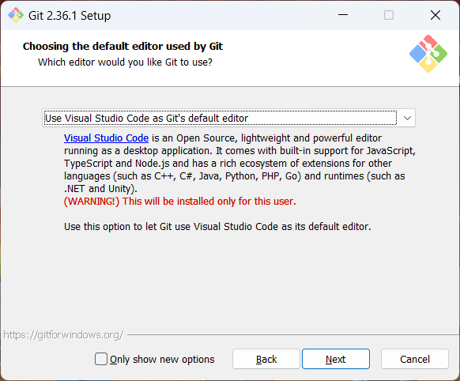

# cruX-intro-to-programming

The repo for everything covered in the cruX: Introduction to Programming workshop

## \[Optional] Intro to Git and GitHub

To go through this Guide, you need to have a GitHub account. Make one.

### Git setup

#### Git install

Git is different from GitHub in the way that porn is different from PornHub. GitHub is just a website where a lot of people upload Git repos.

Git is a program that gives us a nice way of tracking versions of files, which then allows people to collaborate on those files.

GitHub is just a common place to keep these repos. We can also create Issues and Pull Requests to make collaborating on files much easier.

We will use the git cli, and the GitHub website GUI.

To install git, go to https://git-scm.com/downloads and install it.

Most options should just be the default, but make sure you tick the following options:




#### Git configuration

Now, open a terminal (powershell recommended on Windows), and type in

```
git config --global user.name "soumitradev"
```

and **make sure you replace `soumitradev` with your username.**

Now, type in

```
git config --global user.email "email@example.com"
```

and **replace that with your primary email for GitHub.**

Now, we will authenticate our GitHub account on our git so we can easily push our repos and changes to them.

We use something called an ssh key to do this. The below expandable section goes into the details of how exactly ssh authentication works. If interested, you can read that. It is not required, however.

---

<details>
  <summary><b>About ssh authentication</b></summary>
  
SSH authentication uses what is called a "private key" and a "public key". SSH keys can be used to authenticate the origin of, and encrypt information.

- A private key is a key that only you should possess, and should not share.

- A public key is a key that you can share with others. We will see the usefulness of such a thing soon.

If one key is used to lock some information, only the other corresponding key can unlock it. That's how these 2 keys are paired. Someone else's public key can't be used to decrypt information encrypted by your private key.

Usually you use your public key to encrypt information, and a private one to decrypt it, but for identity verification its the opposite.

#### Encryption

So, if I want to send you some information, I will use your public key to encrypt it, and send you the encrypted information. Now, since only you possess your private key, only you will be able to decrypt that information.

If someone else intercepts it, it will be useless to them, since they cannot decrypt it. Trying to brute force an RSA or ED encrypted piece of information is usually mathematically very hard. If you want, you can google and look deeper into it.

#### Identity Verification

If you receive a letter saying it's from me, how would you check if it's really from me?

Say I send you a letter saying

> "I hate EEE so much oh my god.
>
> - Soumitra"

I will attach a small snippet that says

> Hey look it's really me, Soumitra

and I'll encrypt it using my private key.

Now, you can decrypt the snippet using my public key. If it decrypts, it must mean the sender holds my private key, which must mean I was the sender.

This is essentially what GitHub does. Everytime you push changes, you send it with your credentials, and a snippet encrypted with your private key, and GitHub uses your public key to verify if it is really you.

For this, we need to give GitHub your public key, which is essentially what we are doing. We are creating a public-private key pair, and giving GitHub our public key.

This is a very basic, and boiled down description of what happens. The specifics might not be that accurate, but the concept of how it works is important.

</details>

---

To generate a key, type in

```
ssh-keygen -t ed25519 -C "your_email@example.com"
```

and **replace that with your primary email for GitHub.**

Now, we will add the ssh key to the ssh-agent. This is a service that will provide Git with the key when it needs it.

To start the ssh-agent, we have some differneces between Linux and Windows.

If you are on Linux or Mac, you can just open a terminal and type in:

```
eval "$(ssh-agent -s)"
```

If you are on Windows, you have to open a different terminal called "Git Bash". Type it in the start bar, and run it. After it is open, run the above command, and continue. Keep using Git Bash until we tell you to close it.

Now, to add the key to the ssh-agent,

```
ssh-add ~/.ssh/id_ed25519
```

Now, we will add the ssh key to GitHub so it can authenticate you.

You can also now close Git Bash if you are using it.

To add the key, we will need to copy the key first. To print the key, run:

```
cat ~/.ssh/id_ed25519.pub
```

and copy the output.

Now, follow these steps:


After this, pray to ame once more.

#### Test the connection

Now, try ssh-ing into GitHub to test your connection by running:

```
ssh -T git@github.com
```

If you see a warning something like

```
> The authenticity of host 'github.com (IP ADDRESS)' can't be established.
> RSA key fingerprint is SHA256:nThbg6kXUpJWGl7E1IGOCspRomTxdCARLviKw6E5SY8.
> Are you sure you want to continue connecting (yes/no)?
```

type `yes` and hit enter.

1. If it says `> Hi username! You've successfully authenticated, but GitHub does not provide shell access.`, the connection is successful.

2. If it gives some other error, the connection is unsuccessful, and you should DM `@PyRet#4288` or contact me on any other platform.

### Understanding GitHub

A Git repo is like a tree. It can have different branches with different code, it grows everytime you add code to it, and you can merge branches, merge versions and do some wacky shit.

For now, we will look at how we can add and remove code from a Git repo.

A Git repo is where your code will live. This is a Git repo.

First, to start working on a repo, you will have to **clone** it.

#### Cloning a repo

Cloning a repo is basically downloading it, along with all the version information and history the repo has. The entire git repo as is.

To clone a repo, head to the homepage of the repo and click the green "Code" button. Then, make sure you are on the "SSH" tab in the pop up, and copy the command it gives you.

After this, go to wherever you want to clone the repo, and open a terminal there. Make sure your working directory is the intended destination of the repo. If you don't know what a working directory is, go read [this](https://www.digitalocean.com/community/tutorials/a-linux-command-line-primer). It is a primer for Linux shell, but it also (mostly) applies to powershell.

After this, paste the copied command into the terminal, and the repo will be cloned successfully.

After that, you can just open the repo folder, and start making changes to the folder.

Once you make changes, and you're satisfied with them, you want to **stage** them. This basically tells git which changes you want to make to the repo.

#### Staging changes

Git is very powerful. Say you are currently working on features A and B. You are done with the code for A, but you are currently working on B. Now, say your boss wants the code for A urgently. The repo doesn't have the code for A yet, since you didn't push those changes to the repo, but if you push now, you will also end up pushing the incomplete code for B, which will possibly make the code error out.

What you can do is, you mark only some files to be staged, and then push only those. The rest will stay on your system as is, and won't be pushed onto the repo.

To stage a file, you do

```
git add file.png
```

when your working directory is inside the repo.

To stage all files inside the repo, you do

```
git add .
```

Git is smart and will only stage the files that have been modified.

This stages the changes, and tells Git that if we want to push any changes, it's these changes.

Now, you need to essentially "save" this state. You want to make a checkpoint that you can revert back to. This is called a **commit**.

#### Committing files

When you want to create a state that you can revert back to, you want to "commit" files. This takes the changes you staged, and saves them. To create a commit, run:

```
git commit
```

This will open a text editor, where you write your commit message.

Every commit has a message attached to it. The message should ideally describe what changes have been made in the commit. It is advised to keep the commit message below 80 characters.

If you want to directly create a commit using a message,

```
git commit -m "This is my commit message"
```

Now, these staged changes have been saved onto your machine. We now want these changes to go onto GitHub. This is called **pushing**.

#### Pushing

Once you are satisfied with your work, you can just push the commit onto GitHub using:

```
git push
```

This pushes the changes onto GitHub's servers. You can now open the GitHub repo on the GitHub website, and see these changes being reflected.

This command can get slightly complicated when dealing with branches, but we will not go into that just yet.

This depends however. If you have write permissions to the repo, you can directly push these changes to the repo. However, if everyone had write permissions, anyone could write anything without any peer review or approval.

This is where **Issues** and **Pull Requests (PRs)** come in.

#### Forks and Pull Requests

If you don't have permissions to directly write to the repo, you create a **fork**. This is essentially a copy of the repo on your personal account. You have write access to this fork repo, since you are the owner of it.

You can clone this fork repo, and make changes to it, and push them onto GitHub. This only makes changes to your copy of the repo. You can now suggest these changes to the main repo, using something called a "Pull Request".

Once you make these changes and wish to suggest them, you can go back to the GitHub website and create a Pull Request right there:


In the pull request, you can explain what changes you've made, and why. You can also discuss these changes with the maintainers of the repo, and get changes suggested.

You can also edit your code and make additional changes after you open the pull request.

Once you're done making changes, and the maintainers approve your changes, your pull request is "merged". This means it is officially part of the main repo.

If the maintainers believe your changes are not needed, they can also close the PR, rejecting all your changes to the main repo. Your changed copy will remain as it is, however.

#### Issues

An issue is any "ticket" you open in real life. You can add bug reports, complaints and suggestions or feature ideas in Issues, and the maintainers and contributors will know what the community wants from their project.

Issues are usually closely linked to PRs since most PRs are the result of an issue.

#### Good practices in Git

Many times, repos will contain passwords, encryption keys, and other sensitive information or temporary files you don't want exposed in the repo. You will add these files to a file called a `.gitignore`. [See here](https://git-scm.com/docs/gitignore) for more information.

Repos also usually contain a README, which explains the project in the repo in sufficient detail. You are reading a README right now.

Repos also usually contain a LICENSE. This is a legal document in the repo that informs the reader about the rights they have over the repo. Every LICENSE is different, but the important ones are the Creative Commons Licenses, the MIT License, the Apache Licenses, and the GPL licenses. You can go read up on them if you want.
